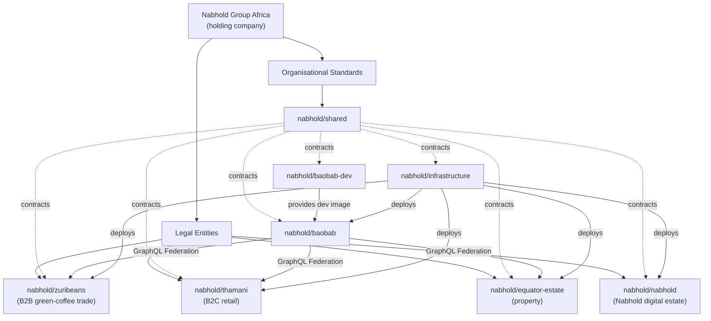
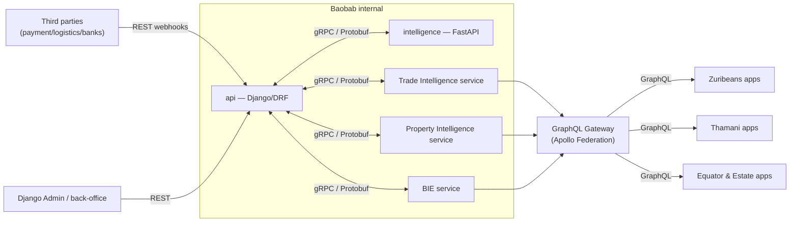

# ADR-0001: Nabhold Digital Estate & Contract Architecture

| | |
|---|---|
| **Status** | Accepted — tenancy portions superseded by ADR-0003 on 2026-09-01 |
| **Date** | 2026-08-26 |
| **Owner** | Chief Software Engineer, Nabhold Group Africa |
| **Repository** | `nabhold/shared` (canonical home for this and future ADRs: `docs/adr/`) |
| **Supersedes** | None (first ADR in the series) |
| **Depends on** | Draft "Development Environment Contract" concept (`.baobab/environment.yaml`) previously proposed for `baobab` |

---

## 1. Context

Nabhold Group Africa is a holding company with three operating subsidiaries — **Zuribeans** (B2B green-coffee trade), **Thamani Global** (B2C retail), and **Equator & Estate Co.** (property) — plus the holding company's own corporate presence. Each subsidiary:

- is a distinct legal entity that must be able to **scale independently into new markets**, each under its **own TLD** (e.g. `zuribeans.co.za`, `zuribeans.co.uk`),
- owns a **full, customer-facing digital estate** (not merely a marketing site) that consumes shared backend capability rather than duplicating it, and
- is expected to grow its own set of market-specific applications over time, i.e. each subsidiary repository is itself a **monorepo**.

Backend business capability (AI/intelligence, trade logic, property logic, etc.) is centralized in **Baobab**, a multi-tenant platform, so that subsidiaries do not each reinvent product logic. Repositories already exist and are empty, awaiting implementation:

```
nabhold/shared          — organisational contracts, schemas, shared packages, CI standards
nabhold/baobab          — Baobab platform: products, services, tenancy model
nabhold/baobab-dev      — packaged, signed, SBOM'd Dev Container image for baobab
nabhold/infrastructure  — AWS/EKS/ArgoCD deployment for all of the above
nabhold/nabhold         — Nabhold (holding co.) digital estate
nabhold/zuribeans       — Zuribeans digital estate (monorepo, Turborepo)
nabhold/thamani         — Thamani Global digital estate (monorepo, Turborepo)
nabhold/equator-estate  — Equator & Estate Co. digital estate (monorepo, Turborepo)
```

Two prior exploratory discussions proposed architectures that partially conflict:

1. A **contract-first, protocol-agnostic** model, in which `nabhold/shared` defines *obligations* ("PostgreSQL 17 required," "tenant data MUST be isolated") and explicitly forbids baking implementation detail (AWS, Kubernetes, GraphQL, gRPC) into those contracts.
2. A **gRPC + GraphQL + Protobuf + Turborepo/Changesets** model, in which `nabhold/shared` compiles and publishes typed API client packages to GHCR, and each subsidiary is a Turborepo workspace consuming them.

Neither, taken alone, matches the confirmed org structure (Zuribeans/Thamani/Equator & Estate/Nabhold), and the second conflicts with the currently *committed* `baobab-dev` toolchain, which contains Python 3.14, Node 24, pnpm, Django/DRF, and FastAPI — but no gRPC, GraphQL, Protobuf, or Turborepo tooling.

This ADR resolves the conflicts, adopts gRPC/GraphQL/Protobuf/Turborepo as **new, additional standards** (not replacements for what's already pinned), and fixes the repository/tenant/contract topology going forward.

---

## 2. Decision

### 2.1 Repository topology (final)



**Rule:** a legal entity may consume Baobab as a tenant without its digital estate becoming part of Baobab, and vice versa. A digital estate neither creates nor prohibits tenancy. ADR-0003 supersedes this ADR's former exclusion of Nabhold: Nabhold consumes `baobab-erp` under a separately provisioned tenant boundary while `nabhold/nabhold` remains the corporate/investor-facing estate.

### 2.2 Canonical legal-entity identity

To prevent four different systems inventing four different spellings of the same entity, `nabhold/shared/contracts/legal-entity/registry.yaml` is the single source of truth:

```yaml
entities:
  - id: NABHOLD
    legal_name: "Nabhold Group Africa"
    role: holding_company
    baobab_tenant: true
    baobab_products:
      - product: baobab-erp
        confirmed: true

  - id: ZURIBEANS
    legal_name: "Zuribeans"
    role: subsidiary
    business_model: B2B
    baobab_tenant: true

  - id: THAMANI-GLOBAL
    legal_name: "Thamani Global"
    role: subsidiary
    business_model: B2C
    baobab_tenant: true

  - id: EQUATOR-ESTATE
    legal_name: "Equator & Estate Co."
    role: subsidiary
    business_model: B2B2C
    baobab_tenant: true
```

Every downstream system (Baobab tenancy, Infrastructure resource ownership tags, each digital estate's own config) references `entity_id`, never a locally invented string.

### 2.3 Product-to-tenant mapping

| Baobab product | Consumed by | Confirmation status |
|---|---|---|
| **Trade Intelligence** | Zuribeans, Thamani Global | ✅ Confirmed |
| **Property Intelligence** | Equator & Estate Co. | ⚠️ Inferred — not yet explicitly confirmed |
| **Baobab Intelligence Engine (BIE)** | Cross-cutting substrate, used by all products/tenants | ⚠️ Inferred — not yet explicitly confirmed |
| **Baobab ERP** | Nabhold (holding co.) | ✅ Confirmed 2026-09-01 |

This mapping determines GraphQL subgraph ownership (§2.5) and must be reconfirmed before subgraph boundaries are cut in code.

### 2.4 Digital estate repositories are full product monorepos

Each of `nabhold/{zuribeans,thamani,equator-estate}` owns an independently deployable digital estate. A repository may adopt a workspace or monorepo only when it actually contains multiple applications or shared packages; Turborepo is available in the standard frontend environment but is not mandatory for a single application.

```
nabhold/zuribeans/
├── package.json
├── src/                             # Next.js App Router application
├── docs/                            # estate-specific architecture and ADRs
├── runtime/                         # deployable service requirements
└── contracts.lock.yaml              # exact Shared and Trade dependencies
```

- **Framework guidance by estate needs** (not mandated across unrelated subsidiaries):
  - Zuribeans (B2B catalogue and buying journeys): **Next.js App Router**, consuming the Medusa v2 Store API supplied by `nabhold/baobab-trade`.
  - Thamani Global (B2C retail storefront): **Next.js App Router**, consuming the Medusa v2 Store API supplied by `nabhold/baobab-trade`.
  - Equator & Estate (listings + transactional flows, mixed public/auth): **Next.js**, evaluated per app.
- A new market does not automatically require a new application. Market-to-region, sales-channel and domain mapping must first be defined by a canonical contract; application boundaries follow demonstrated deployment or experience differences rather than geography alone.
- Shared UI packages remain optional contracts, not mandatory repository structure. An estate may introduce a local brand wrapper when it actually consumes shared headless primitives; Zuribeans currently owns its presentation components directly.

### 2.5 Interface contracts: two tiers, not one

This is the reconciliation of the two prior proposals. `nabhold/shared/contracts/` splits into two tiers with **different rules**:

| Tier | Examples | Format | Rule |
|---|---|---|---|
| **Governance contracts** | development-environment, security, tenancy, legal-entity, observability, AI governance | Plain YAML | Must stay protocol- and vendor-agnostic. States obligations ("tenant data MUST be isolated," "Python 3.14 required"), never implementation ("use RDS," "use gRPC"). |
| **Interface contracts** | Baobab's product APIs, both internal and external | `.proto` (gRPC) + GraphQL SDL | **Allowed and expected** to be technology-specific — their entire purpose is to pin a wire format precisely enough to generate typed clients from it. |

The earlier "contracts must not encode implementation" rule governed the *governance* tier only. An interface contract *is* the implementation-facing layer by design; conflating the two tiers was the source of the apparent contradiction.

**Adopted interface architecture:**



- **Internal (Baobab-to-Baobab): gRPC + Protobuf.** Strongly typed, low-latency, streaming-capable; works from both Django/DRF and FastAPI via `grpcio`. Proto field numbers give clean backward-compatible versioning.
- **External (subsidiary apps → Baobab products): GraphQL via Apollo Federation**, one subgraph per product (Trade Intelligence, Property Intelligence, BIE), one gateway. A single gateway keeps cross-cutting concerns (auth, tenant-context resolution) centralized instead of duplicated three times; each product team still owns its own subgraph independently.
  - *Why not gRPC-web for the frontend leg:* browsers can't speak gRPC natively without a translating proxy, and the three subsidiaries have very different query shapes (cart vs. freight pricing vs. property listings) that GraphQL's field-selection model fits better than a fixed RPC surface.
- **REST/DRF is retained**, not replaced, for: Django Admin/back-office, and inbound webhooks from third parties that only speak REST (payment processors, banks, logistics carriers).

### 2.6 Package publishing (GHCR)

Published from `nabhold/shared`:

| Package | Contents | Consumed by |
|---|---|---|
| `@nabhold/contracts-ts` | TypeScript types generated from `.proto` + GraphQL SDL | All subsidiary frontends |
| `nabhold-contracts-py` | Python stubs generated from the same `.proto`/SDL sources | `nabhold/baobab` |
| `@nabhold/ui-core` | Headless primitives (Radix/Ark) + design tokens | Subsidiary `packages/brand-ui` wrappers |
| `@nabhold/eslint-config`, `@nabhold/tsconfig` | Shared JS/TS tooling config | All Turborepo workspaces |
| `@nabhold/create-tenant-app` | Scaffolding CLI for a new market app | Subsidiary repos, when opening a new market |

- **TS side:** Changesets → GitHub Actions → GHCR, matching the previously drafted publish workflow (PR-based "Version Packages" flow, not direct-publish-on-merge).
- **Python side — open gap, needs a decision in ADR-0002:** Changesets is JS-only. Candidate: `python-semantic-release` publishing to a private PyPI-compatible GHCR feed, triggered by the same `.proto`/SDL source change. Do not assume this is settled; it needs its own short design note before `baobab`'s CI depends on it.

### 2.7 Rollout sequence

Consistent with "one change at a time, committed files are ground truth":

1. `nabhold/shared/contracts/legal-entity/registry.yaml` + governance contract schemas (dev-environment, security, tenancy skeletons)
2. `nabhold/shared` proto/GraphQL skeleton + publish workflow (TS side first, Python side as a follow-up ADR)
3. `baobab-dev` — wire `.baobab/environment.yaml` contract validation against `versions.lock` (per the previously drafted Development Environment Contract)
4. `baobab` — service boundaries (api/intelligence/trade/property/bie), internal gRPC wiring, GraphQL subgraphs
5. Subsidiary Turborepo skeletons (`zuribeans`, `thamani`, `equator-estate`, `nabhold`) consuming published `@nabhold/*` packages
6. `infrastructure` — AWS/EKS/ArgoCD wiring, per-market TLD ingress routing

---

## 3. Consequences

**Positive:**
- Subsidiaries can ship independently (new market = new app folder, not a cross-repo coordination event).
- A single gateway + typed contracts eliminates "six different names for the same legal entity" and API drift between Baobab and three separately-run frontend teams.
- Governance contracts remain reusable if the cloud vendor or transport ever changes; interface contracts absorb that churn instead.

**Costs / risks accepted:**
- Two contract tiers, two publishing pipelines (TS via Changesets, Python still undecided) — more moving parts than a single-repo monolith.
- GraphQL Federation adds an operational component (the gateway) that must itself be deployed, monitored, and versioned by `infrastructure`.
- Turborepo is genuinely new to this toolchain; onboarding cost for engineers unfamiliar with it.

---

## 4. Open decisions (explicitly deferred, not resolved here)

1. ~~Frontend dev-environment image~~ — **Resolved 2026-08-26**, see Amendment Log.
2. Python contract-package versioning/publishing tool (candidate: `python-semantic-release`).
3. Confirm Property Intelligence → Equator & Estate, and BIE-as-cross-cutting, per §2.3.
4. Reconciliation against the CIO's architecture document once available; accepted amendments remain authoritative until explicitly superseded.
5. Canonical market-to-region, sales-channel and domain mapping for multi-market estates.

### 2.8a Development-environment contract: profile concept and naming (resolved)

Both `baobab` and the four digital-estate repos need a development-environment contract — not just `baobab`. Rather than four independent declarations that can silently drift apart, the contract schema introduces a **profile** concept:

- `full` — everything `baobab` needs (Python, Node, Flutter, PostgreSQL client, etc.), sourced from `baobab-dev`'s default build.
- `frontend` — Node, pnpm and Turborepo, sourced from `baobab-dev`'s `--target frontend` stage (§2.8).
- `frontend-e2e` — the CI-only browser profile extending `frontend` with Playwright and browser binaries; it is never the daily development declaration.

Each consuming repository (`baobab`, `nabhold`, `zuribeans`, `thamani`, `equator-estate`) carries its own declaration at a **consistently named path across all five repos: `.nabhold/environment.yaml`** — superseding the earlier draft's `.baobab/environment.yaml` naming. Consistency here is what allows one generic validator in `nabhold/shared` to check all five repos the same way instead of five bespoke checks. The four frontend repos' declarations are expected to be short (`profile: frontend` + minimum `baobab-dev` version), not a full re-declaration of tooling versions.

**Known gap, not yet resolved:** `versions.yaml` does not currently contain Turborepo or Playwright entries. The `frontend` profile is defined at the contract-schema level now, but is not yet realizable against the actual `baobab-dev` build until those entries are added — this is `baobab-dev` implementation work, sequenced at rollout step 3, not a `shared`-repo blocker.

### 2.8 Frontend dev-environment image (resolved)

No new repository. `baobab-dev`'s existing Dockerfile gains a `--target frontend` build stage, reusing the already-hardened, signed, SBOM'd, multi-arch pipeline rather than duplicating it in a second repo. Concretely, this means:

- A new build stage (e.g. `FROM base AS frontend`) that carries forward Node 24 + pnpm + Turborepo + Playwright, but drops the Python/uv/Poetry and Flutter layers that a pure front-end engineer doesn't need.
- The same `publish.yml` workflow gains a second tagged output (e.g. `ghcr.io/nabhold/baobab-dev:v1.0.0-frontend`) alongside the existing full image — same cosign signing, same Trivy gate, same SBOM attestation pipeline, just a smaller final layer set.
- This is a `baobab-dev` repository change, sequenced at rollout step 3 (§2.7), not part of the `nabhold/shared` work starting now. Implementation detail (exact stage boundary, base-layer reuse) is deferred to when that step is reached — flagging it here only to close the open decision, not to design it prematurely.
- Shared front-end **packages** (`@nabhold/ui-core`, `@nabhold/contracts-ts`, `@nabhold/eslint-config`, etc.) live in `nabhold/shared` per §2.6 regardless of which image builds them — the dev-environment image and the package registry are separate concerns and this decision doesn't blur them.

---

## Amendment Log

| Date | Change | Reason |
|---|---|---|
| 2026-08-26 | §2.8 added; open item #1 resolved to "extend `baobab-dev` Dockerfile with `--target frontend`, no new repo" | Explicit decision: avoid a second devcontainer repo; prefer lower maintenance burden over pipeline isolation |
| 2026-08-26 | §2.8a added; development-environment contract adopts a `profile` concept (`full`/`frontend`); per-repo declaration renamed to `.nabhold/environment.yaml` across all five consuming repos | Explicit decision: consistency enables one shared validator instead of five bespoke checks; avoids four digital-estate repos each independently declaring (and drifting on) identical frontend tooling versions |
| 2026-09-01 | §§2.1–2.3 amended and ADR-0003 added | Nabhold consumes Baobab ERP; estate ownership, legal-entity identity and platform tenancy are independent concerns |

---

## 5. Alternatives considered

- **Single shared Next.js frontend inside `baobab`, white-labeled per tenant.** Rejected: conflicts with the explicit requirement that each subsidiary scale independently per-market/per-TLD; a shared frontend recouples three businesses with different release cadences and frameworks-of-choice.
- **REST-only (no gRPC/GraphQL).** Rejected: matches today's committed toolchain but was explicitly superseded by direction in §2.5 — kept as a fallback note in case Python-side proto tooling proves too costly.
- **One contract format for everything (no governance/interface split).** Rejected: this was the actual source of the original conflict between the two prior proposals; splitting it is the resolution, not a compromise.
