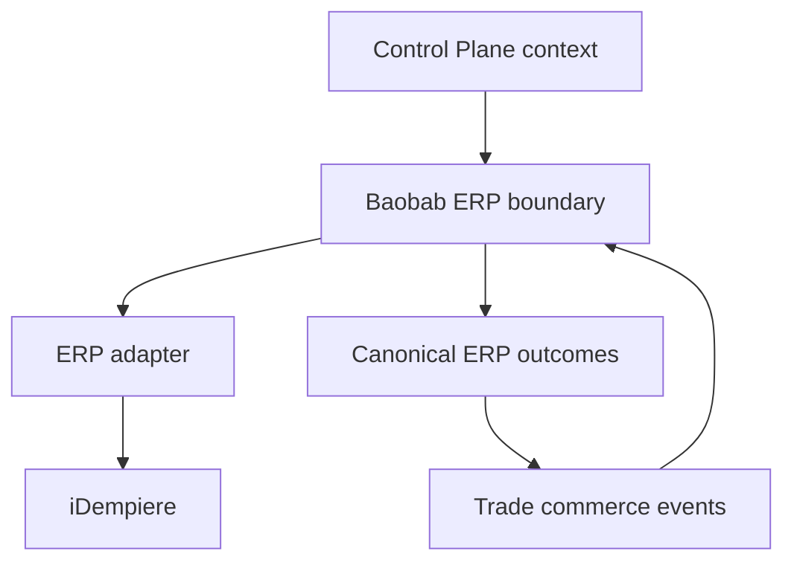

# Baobab ERP boundary contracts

The Baobab ERP Engine is an anti-corruption boundary around an upstream ERP
product. Cross-engine callers communicate with Baobab contracts; only the ERP
adapter communicates with iDempiere representations.

## Interaction classification

| Interaction | Contract | Consistency | Reason |
|---|---|---|---|
| Request ERP provisioning | OpenAPI command | Immediate acceptance, eventual completion | Caller needs an operation identifier, not completed ERP setup |
| Query provisioning, mapping, order or stock status | OpenAPI query | Current projection | Caller needs an immediate observation |
| Commerce order/customer propagation | AsyncAPI event | Eventual | ERP consequences must survive partial failure and retries |
| ERP order, inventory, warehouse, invoice and payment outcomes | AsyncAPI event | Eventual | Downstream projections must not create a distributed transaction |

Every tenant-scoped event and request must carry Control Plane-resolved tenant
context and authorised workload identity. The public temporal mapping records a
canonical owner/reference and a Baobab ERP public resource ID. iDempiere Client,
Organisation and table IDs remain private adapter data.

## Ownership splits

| Process | Commerce/other owner | ERP owner | Conflict rule |
|---|---|---|---|
| Sales | Trade commerce order | Enterprise order consequence | Amend or compensate; never reverse-sync fields |
| Tax | Trade quotation | Statutory determination/posting | Difference becomes an exception or correction document |
| Payment | Provider/Trade capture | Accounting receipt/allocation | Never infer capture from order status |
| Inventory | Trade reservation/demand | Physical and financial stock | No quantity overwrite; reconcile explicitly |
| Shipment | Trade customer fulfilment | Warehouse goods movement | Invalid state transitions are quarantined |

The exhaustive machine-readable ownership matrix is
`contracts/erp/v1/system-of-record.yaml`. An unassigned canonical organisation
model is recorded as unassigned rather than guessed. Infrastructure topology is
referenced through an opaque policy ID and is not part of this contract.

## Compatibility expectations

- Public schemas are closed and versioned by major path.
- Money and quantity values are decimal strings; currency and country use ISO
  alphabetic codes without a default country, currency or timezone.
- Business codes and document numbers are explicitly non-identifying.
- Side effects use the canonical idempotency policy; event consumers dedupe on
  `(source, id)` and process business versions monotonically.
- Contract fixtures cover more than one country and use USD intentionally to
  prevent a South Africa/ZAR assumption from entering the platform core.

